```mermaid
sequenceDiagram
  box provider0
  participant 🤖ContiniousDeploymentRunner
  end
  box providerN
  participant CloudControlPlaneAPI
  end
  🤖ContiniousDeploymentRunner ->> CloudControlPlaneAPI: auth
  activate CloudControlPlaneAPI
  CloudControlPlaneAPI ->> 🤖ContiniousDeploymentRunner: 200 OK "hello 🤖ContiniousDeploymentRunner"
  🤖ContiniousDeploymentRunner ->> CloudControlPlaneAPI: terraform apply
  CloudControlPlaneAPI ->> 🤖ContiniousDeploymentRunner: Success
  🤖ContiniousDeploymentRunner ->> CloudControlPlaneAPI: terminate session
  CloudControlPlaneAPI ->> 🤖ContiniousDeploymentRunner: 200 OK
  deactivate CloudControlPlaneAPI
```

# Cross Cloud Identities in Zero Trust POC

## What is this?
This repository serves as an artifact demonstrating how federated user and workload identity can be done effectively across multiple cloud services without long lived credentials, or individual credentials for humans for each user (single sign on, or SSO).

GDS invited a number of providers to come together collaboratively in our offices for a day to kick this off, with an expectation that this would receive long term support/maintenance from those providers and the invitation is open to any other providers that wish to contribute the relevant implementation for their domain.

The initial day was set out in [Levels](#levels) to game-ify and provide a easy way to create tests, and measure how everyone was getting on, these levels are useful to clearly show the capability achieved too.

## Infrastructure as code

Everything must be Infrastructure as code, where any bootstrap [ClickOps](https://en.wiktionary.org/wiki/ClickOps) is necessary, providers MUST document this, including full screenshots, and where possible backfill this with Infrastructure as code implementation to at least show drift detection.

We will be using [Terraform](https://www.terraform.io/) for this, and providers should provide examples of how to do this for their domain, this allows us to use the same tooling to bootstrap and test the implementation without having to learn new tooling to just understand what is going on.

## Tests

Tests are provided, to prove everything works, and continues to work.
There are some stubs of tests created by GDS to kick things off and written in GHERKIN so that they can be written in plain english and the providers can create the necessary implementation to prove that it works

## Workload app
There is a simple workload app stub in this repository that can function as a starting point for the providers to build their own workload app, we expect all apps to be written in Typescript and include local unit tests with sufficient coverage to prove the app is working in isolation.


## Levels

### Level 1 


```gherkin
As a User 
I want to login to the console
So that I can I can interact with the cloud provider
```

### Level 2



```gherkin
As a Continious Deployment runner
I want to use my workload identity to access the cloud
So that I can deploy to the cloud
```

> BOOTSTRAP COMPLETE 🎉

### Level 3


```gherkin
As a Human
...
```

### Level 4


```gherkin
As a Human
...
```

### Level 5


```gherkin
As a Human
...
```

### Level 6


```gherkin
As a Human
...
```

### Level 7


```gherkin
As a Human
...
```

### Level 8


```gherkin
As a Human
...
```

### Level 9


```gherkin
As a Human
...
```


### Level 10


```gherkin
As a Human
...
```


### Level 11


```gherkin
As a Human
...
```
